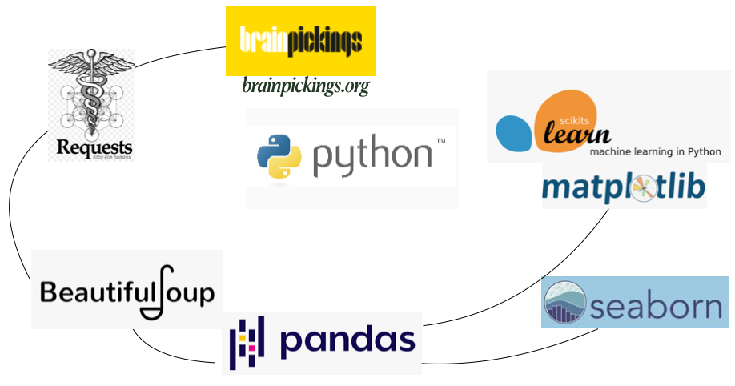

"A museum of my mind": A Natural Language Processing Perspective of BrainPickings.org
======================

"One of the great cruelties and great glories of creative work is the wild discrepancy of timelines between vision and execution. When we dream up a project, we invariably underestimate the amount of time and effort required to make it a reality. Rather than a cognitive bug, perhaps this is the supreme coping mechanism of the creative mind — if we could see clearly the toil ahead at the outset of any creative endeavor, we might be too dispirited to begin, too reluctant to gamble between the heroic and the foolish, too paralyzed to walk the long and tenuous tightrope of hope and fear by which any worthwhile destination is reached." -Maria Popova

## Contents
- [Overview](#overview)
- [The Site](#ovethe-siterview)
- [The Posts](#the-posts)
- [Building a classifier](#building-a-classifier)
- [Results](#results)
- [Acknowledgements](#acknowledgements)

___

## Overview

Began in 2007, Brain Pickings has grown into one of the most popular blogs worldwide in a very competitive space. With diverse topics including art, literature, science, and philosophy, the blog has been described as a "museum of the world" and a "treasure trove." It has millions of unique readers per month and both Tim Ferriss and James Altucher, popular authors and bloggers in their own right, say Brain Pickings is the only blog they read regularly. Given the amount of thoroughly-researched content on Brain Pickings, one would reasonably assume that a staff of writers is behind it. In fact, Maria Popova is the sole author of every article on the blog and she maintains her site without a single advertisement, relying, as Wikipedia does, on donations.

Ms. Popova defined herself as a "spiritual embryo" at the outset of her blog. Initially, she distributed her work in the form of an email to a few close friends. As her reading and writing habit evolved from a pastime into a morning-to-night obsession, her writing adopted a highly-referential, associative style evoking long-dead authors and little-known historical events. The reader rarely encounters a personal remark in her writing, adding an element of detachment and even mystique to her insights. Rather than explore her struggles both personal and intellectual in the first-person therapy, she finds answers in the "original hypertext," her phrase for the literary canon our generation has inherited but frequently ignored. In trailblazing a path through the common record, she has found an enormous following online, demonstrating that the personal truly is the universal.

As of April 2021, Brain Pickings has amassed 5,700 articles totaling over 5 million words. To put this accomplishment in perspective, Ms. Popova has published a 900+ word article every 21 hours...for 13.5 years. This project gave me the opportunity to dive into the evolving themes of Brain Pickings based on frequently occurring words and phrases throughout the body of work.

___

## The Site

Brainpickings.org is conveniently organized in chronological fashion, with most recent posts appearing on page 1 and the oldest posts appearing on the last page, numbered 1426 at time of writing. This fact made acquiring the data for the following steps via Requests relatively straightforward. From there, a search of the articles' HTML revealed the specific header below which each post is recorded. I parsed this data, including title, date, subtitle, and the articles themselves, with the help of BeautifulSoup. Finally, I added a word count function before saving the data in a .csv file.

___

## The Posts

By way of summary, I observe an increase in ouput to multiple postings per day as the blog gained in popularity. Posting frequency has tapered off to a mere mortal rate of every-other-day in recent years.

Word output peaked in 2014 |  Post-frequency picked up in 2011
:-------------------------:|:-------------------------:
   |  

**Thematic trends**

For these graph, I omitted the "culture" and "books" tags as they showed up in a vast majority of posts, dwarfing the relative differences between lesser used but more informational tags. Based only on these tags, one would assume the blog is about culture and books, and while this is true, the actual topics Ms. Popova covers in this "museum of the mind" are far more diverse. The changes I identify in between her early to late periods are from sensory- to textual-based topics, or seen another way, from right-brain to left-brain if I may make a neurological inference. Design, cinema, and music morph to philosophy, poetry, and letters.

Popular tags (2007-mid 2014) |  Popular tags (mid 2014-April 2021)
:---------------------------:|:-------------------------:
   |  

 

Ms. Popova expressed an interest in three particular categories, love, poetry, and science, in a single email exchange at the outset of this project. In corcordance with this interest, I generated a plot showing the relative frequency of these tags over time. Most evident is an increasing interest in poetry.

 

___

## Building a classifier

I decided to build a classification model that would predict whether an article was from Ms. Popova's early or late era, defined here as 2007-2013 and 2015-2021. These dates coincide nicely with her twenties and thirties respectively. I hoped to capture some of what defines these epochs in terms of creative and intellectual development. 

### Dividing the classes

|                   | Early class  | Late class  |
|-------------------|--------------|-------------|
| years             | 2007-2013    | 2015-2021   |
| article count     | 3,069        | 1,927       |
| word count        | 1.94 million | 2.29 million|

While I have published true article counts here, I balanced the classes at 1,927 before modeling. I originally accomplished this with SMOTE (synthetic minority oversampling) of the late class. However, after further research, I chose to simply drop articles from the early class of the shortest length until the classes were even. This decision was based on the preponderance of very short articles in the early class versus the late class, the shortness of which would provide fewer key words to classify the text. In practice, this resulted in dropping 1,172 articles of under 290 words. Below is a histogram of word counts across all articles, evidently a gamma distribution.

 

Astute obsevers will notice the omission of 2014 posts. This decision was made after an initial logit model showed half of all errors occurring in this dividing year. It makes sense that a classification model would have the most trouble distinguishing articles published closest together. Style is only binary to literary critics. Although 2014 was Ms. Popova's most productive year as a writer in terms of word count, I excluded it from the further models in order to increase class contarst and make a stronger classifier.

 

### Creating the feature matrix

The `sklearn.feature_extraction` module provides a way to transform raw text documents into a numerical feature matrix suitable for machine learning algorithms. The Tf-idf (term frequency-inverse document frequency) vectorizer used here first a

#### Document frequency parameters

#### Stop words

### Insights from a single decision tree

 
 
 

### Growing a forest

 
 
      
___

   
## Results

 
 
 
 

___
	
## Acknowledgements

* Maria Popova, without whose discipline, erudition, and wisdom, readers like myself would be deprived of a unique and valuable resource.

* Dan Rupp, data science instructor at Galvanize Austin, for his excellent suggestions regarding the selection of the feature space and interpretation of the classification model and Dr. Juliana Duncan, lead data science instructor at Galvanize Austin, for her leading questions and conceptual help with statistical topics.

