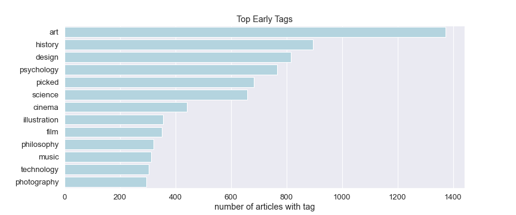
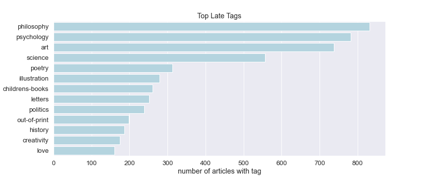

"A museum of my mind": A Natural Language Processing Perspective of BrainPickings.org
======================

"One of the great cruelties and great glories of creative work is the wild discrepancy of timelines between vision and execution. When we dream up a project, we invariably underestimate the amount of time and effort required to make it a reality. Rather than a cognitive bug, perhaps this is the supreme coping mechanism of the creative mind — if we could see clearly the toil ahead at the outset of any creative endeavor, we might be too dispirited to begin, too reluctant to gamble between the heroic and the foolish, too paralyzed to walk the long and tenuous tightrope of hope and fear by which any worthwhile destination is reached." -Maria Popova

## Contents
- [Overview](#overview)
- [The Site](#ovethe-siterview)
- [The Posts](#the-posts)
- [Hypotheses and Method](#Hypotheses-and-Method)
- [Results](#Results)
- [Acknowledgements](#Acknowledgements)

___

## Overview

Began in 2007, Brain Pickings has grown into one of the most popular blogs worldwide in a very competitive space. With diverse topics including art, literature, science, and philosophy, the blog has been described as a "museum of the world" and a "treasure trove." It has millions of unique readers per month and both Tim Ferriss and James Altucher, popular authors and bloggers in their own right, say Brain Pickings is the only blog they read regularly. Given the amount of thoroughly-researched content on Brain Pickings, one would reasonably assume that a staff of writers is behind it. In fact, Maria Popova is the sole author of every article on the blog and she maintains her site without a single advertisement, relying, as Wikipedia does, on donations.

Ms. Popova defined herself as a "spiritual embryo" at the outset of her blog. She also began reading seriously at this time, which can be seen as  an increasing breadth of refrences as the articles progress. One rarely encounters a personal comment in her writing. Rather she prefers to share her private exploration in the form of literary criticism, historical abstracts, and scientific inquiries. 

As of April 2021, Brain Pickings has amassed 5,700 articles totaling over 5 million words. To put this accomplishment in perspective, Ms. Popova has published a 900+ word article every 21 hours...for 13.5 years. This project gave me the opportunity to dive into the evolving themes of Brain Pickings based on frequently occurring words and phrases throughout the body of work.
___

## The Site

Brainpickings.org is conveniently organized in chronological fashion, with most recent posts appearing on page 1 and the oldest posts appearing on the last page, numbered 1426 at time of writing. This fact made acquiring the data for the following steps via Requests relatively straightforward. From there, a search of the articles' HTML revealed the header below which each post is recorded. I parsed this data, including title, date, subtitle, and the articles themselves, with the help of BeautifulSoup. Finally, I added a word count function before saving the data in a .csv file.
___

## The Posts

By way of summary, I observe an increase in ouput to muliplte postings per day as the blog gained popularity. Frequency has tapered off to a mere mortal rate of every-other-day in recent years.

Word output peaked in 2014 |  Post-frequency increased in 2011
:-------------------------:|:-------------------------:
   |  

**Thematic trends**

For these graph, I omitted "culture" and "books" tag as they showed up in a majority of posts. Based only on tags, one would assume the blog is usually about culture and books, and while this is true, the actual topics Ms. Popova covers in this "museum of the mind" are far more diverse. The primary shifts I identify are from design, history, cinema/film, and music to philosophy, science, poetry, and letters.

Popular tags (2007-mid 2014) |  Popular tags (mid 2014-April 2021)
:-------------------------:|:-------------------------:
   |  

In reply to direct communication with Ms. Popova, I generated this plot showing the trends of three tags in particular. Most evident is an increasing interest in poetry.

 

___

## The Model

I decided to build a classification model that would predict whether an article was from Ms. Popova's early or late era, defined here as 2007-2013 and 2015-2021. These dates coincide nicely with her twenties and thirties respectively. I hoped to capture some of what defines these epochs in terms of creative and intellectual development. 

### The Classes

|                   | Early class  | Late class  |
|-------------------|--------------|-------------|
| dates             | 2007-2013   | 2015-2021   |
| article count     | 3,192       | 1,927       |
| word count        | 1.94 million | 2.25 million|

While I have published actual article counts here, I balanced the classes at 1,927. I originally accomplished this with SMOTE (synthetic minority oversampling) of the late class. However, after further research, I chose to simply drop articles from the early class of the shortest length until the classes were even. This decision was based on the preponderance of very short articles in the early class versus the late class, the shortness of which would provide fewer key words to classify the text. In practice, this resulted in dropping over a thousand articles of under 290 words.

 

Astute obsevers will notice the omission of 2014 posts. This decision was made after running an initial logistic regression model with 2014 and observing half of all errors occurring in this dividing year. It makes sense that the model would have the most trouble distinguishing articles published closest together. Although, this was Ms. Popova's most productive year as a writer based on word count, I excluded these posts from the dataset as well in order to make a stronger classifier.

 

 
 

 
 
 
      
___

   
## The Results

 
 
 
 
___
	
## Acknowledgements
* Maria Popova, without whose discipline, erudition, and wisdom, readers like myself would be deprived of her work.
* Dan Rupp, data science instructor at Galvanize Austin, for his excellent suggestions regarding the selection of the feature space and interpretation of the model results and Dr. Juliana Duncan, lead data science instructor at Galvanize Austin, for her leading questions and conceptual help with statistical topics.

